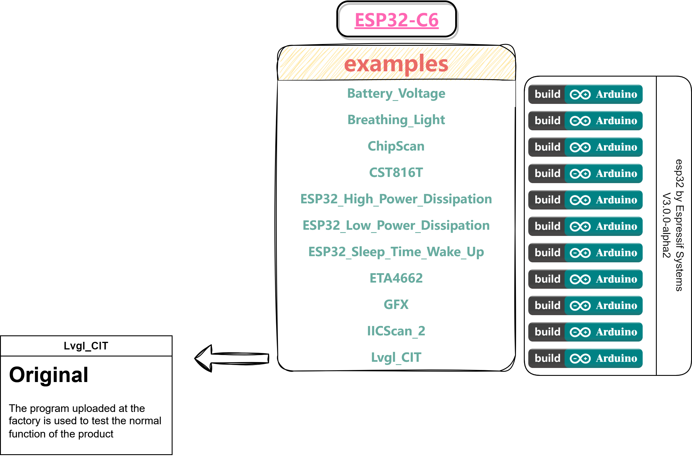

<!--
 * @Description: None
 * @version: V1.0.0
 * @Author: LILYGO_L
 * @Date: 2023-09-11 16:13:14
 * @LastEditors: LILYGO_L
 * @LastEditTime: 2023-12-22 16:23:58
 * @License: GPL 3.0
-->
<h1 align = "center">TQT-C6</h1>

 
  <!-- 
   -->
  

 

## **English | [中文](./README_CN.md)**

## Version iteration:
| Version                              | Update date                       |
| :-------------------------------: | :-------------------------------: |
| TQT-C6_V1.0            | 2023-12-20                         |

## PurchaseLink

| Product                     | SOC           |  FLASH  |  PSRAM   | Link                   |
| :------------------------: | :-----------: |:-------: | :---------: | :------------------: |
| TQT-C6_V1.0   | ESP32C6 |   4M   | -|  [Not yet sold]()  |

## Directory
- [Describe](#describe)
- [Preview](#preview)
- [Module](#module)
- [QuickStart](#quickstart)
- [PinOverview](#pinoverview)
- [FAQ](#faq)
- [Project](#project)
- [Information](#information)
- [DependentLibraries](#dependentlibraries)

## Describe

TQT-C6 is a mini development board based on the ESP32C6 chip, which is only slightly larger than two thumbs. It features a 128x128px TFT full-color touch screen, a separate charging indicator light, and an independent battery. It can communicate with the power path management chip to modify the power bus status and limit values. When the main chip enters the light_sleep mode, the static current at the battery location is only about 500uA. In deep_sleep mode, it can achieve an extremely low power consumption of 100uA.

## Preview

### PCB board

<b>TQT-C6</b>

##### TQT-C6 Front

##### TQT-C6 Back

### Rendering

## Module

### 1. ESP32-C6-MINI-1U

* Module: ESP32-C6-MINI-1U
* PSRAM: 4M 
* FLASH: -
* Other notes: For more information, please visit [Espressif ESP32-C6-MINI-1U datasheet](https://www.espressif.com/sites/default/files/documentation/esp32-c6-mini-1_mini-1u_datasheet_en.pdf)

### 2. 0.85 Inch 128x128 pixel LCD display screen

* Drive: GC9107
* Compatibility Library: Arduino_GFX、Lvgl
* Bus communication protocol: Standard SPI

### 3. Touch chip

* Chip: CST816T
* Bus communication protocol: IIC
* Other notes: Supports up sliding, down sliding, left sliding, right sliding, double clicking, clicking, and long pressing gestures for triggering, as well as a combination of multiple interrupt triggering methods. By default, it automatically enters sleep power-saving mode after a few seconds without touch

### 4. Power Management Chip

* Chip: ETA4662
* Bus communication protocol:IIC
* Other notes: A chip with power path management that automatically recognizes battery power and USB power, automatically switches to USB power when there is no battery inserted, and automatically switches to battery power when there is no USB power

## QuickStart

## Attention: Currently, ESP32C6 can only be programmed using the Arduino IDE

### Examples Support

    

### PlatformIO
1. Install[VisualStudioCode](https://code.visualstudio.com/Download),Choose installation based on your system type.

2. Open the "Extension" section of the Visual Studio Code software sidebar(Alternatively, use "<kbd>Ctrl</kbd>+<kbd>Shift</kbd>+<kbd>X</kbd>" to open the extension),Search for the "PlatformIO IDE" extension and download it.

3. During the installation of the extension, you can go to GitHub to download the program. You can download the main branch by clicking on the "<> Code" with green text, or you can download the program versions from the "Releases" section in the sidebar.

4. After the installation of the extension is completed, open the Explorer in the sidebar(Alternatively, use "<kbd>Ctrl</kbd>+<kbd>Shift</kbd>+<kbd>E</kbd>" go open it),Click on "Open Folder," locate the project code you just downloaded (the entire folder), and click "Add." At this point, the project files will be added to your workspace.

5. Open the "platformio.ini" file in the project folder (PlatformIO will automatically open the "platformio.ini" file corresponding to the added folder). Under the "[platformio]" section, uncomment and select the example program you want to burn (it should start with "default_envs = xxx") Then click "<kbd>[√](image/4.png)</kbd>" in the bottom left corner to compile,If the compilation is correct, connect the microcontroller to the computer and click "<kbd>[→](image/5.png)</kbd>" in the bottom left corner to download the program.

### Arduino
1. Install[Arduino](https://www.arduino.cc/en/software),Choose installation based on your system type.

2. Open the "example" directory within the project folder, select the example project folder, and open the file ending with ".ino" to open the Arduino IDE project workspace.

3. Open the "Tools" menu at the top right -> Select "Board" -> "Board Manager." Find or search for "esp32" and download the board files from the author named "Espressif Systems." Then, go back to the "Board" menu and select the development board type under "ESP32 Arduino." The selected development board type should match the one specified in the "platformio.ini" file under the [env] section with the header "board = xxx." If there is no corresponding development board, you may need to manually add the development board from the "board" directory within your project folder.

4. Open menu bar "[File](image/6.png)" -> "[Preferences](image/6.png)" ,Find "[Sketchbook location](image/7.png)"  here,copy and paste all library files and folders from the "libraries" folder in the project directory into the "libraries" folder in this directory.

5. Select the correct settings in the Tools menu, as shown in the table below.

| Setting                               | Value                                 |
| :-------------------------------: | :-------------------------------: |
| Upload Speed                     | 921600                               |
| CPU Frequency                   | 160MHz                              |
| Flash Mode                         | QIO                                   |
| Flash Size                           | 4MB (32Mb)                     |
| Core Debug Level                | None                                 |
| Partition Scheme                | Huge APP (3MB No OTA/1MB SPIFFS)                                 |

6. Select the correct port.

7. Click "<kbd>[√](image/8.png)</kbd>" in the upper right corner to compile,If the compilation is correct, connect the microcontroller to the computer,Click "<kbd>[→](image/9.png)</kbd>" in the upper right corner to download.

### firmware download
1. Open the project file "tools" and locate the ESP32 burning tool. Open it.

2. Select the correct burning chip and burning method, then click "OK." As shown in the picture, follow steps 1->2->3->4->5 to burn the program. If the burning is not successful, press and hold the "BOOT-0" button and then download and burn again.

3. Burn the file in the root directory of the project file "[firmware](./firmware/)" file,There is a description of the firmware file version inside, just choose the appropriate version to download.

    
    

## PinOverview

| LCD PIN      | ESP32S3 PIN     |
| :------------------: | :------------------:|
| MOSI                     | IO15                  |
| SCLK                  | IO18                  |
| RST                    | IO20                  |
| BL                      | IO2                  |
| CS                    | IO14                  |
| DC                    | IO19                  |

| Battery Related PIN | ESP32S3 PIN      |
| :------------------: | :------------------:|
| Battery_Measurement_Control  | IO8                  |
| Battery_ADC_Data                  | IO6                    |

| Breathing Light PIN          | ESP32S3 PIN      |
| :------------------: | :------------------:|
| Breathing_Light                  | IO9                  |

| Touch Chip PIN          | ESP32S3 PIN      |
| :------------------: | :------------------:|
| RST                  | IO23                  |
| INT                  | IO7                    |
| SDA                  | IO21                  |
| SCL                  | IO22                  |

| Sleep Wake UP PIN          | ESP32S3 PIN      |
| :------------------: | :------------------:|
| SLEEP_WAKE_UP_INT      | IO7                  |

| Power Management Chip PIN          | ESP32S3 PIN      |
| :------------------: | :------------------:|
| SDA      | IO21                  |
| SCL      | IO22                  |

## FAQ

* Q. After reading the above tutorials, I still don't know how to build a programming environment. What should I do?
* A. If you still don't understand how to build an environment after reading the above tutorials, you can refer to the [LilyGo-Document](https://github.com/Xinyuan-LilyGO/LilyGo-Document) document instructions to build it.

 

* Q. Why does Arduino IDE prompt me to update library files when I open it? Should I update them or not?
* A. Choose not to update library files. Different versions of library files may not be mutually compatible, so it is not recommended to update library files.

 

* Q. Why is there no serial data output on the "Uart" interface on my board? Is it defective and unusable?
* A. The default project configuration uses the USB interface as Uart0 serial output for debugging purposes. The "Uart" interface is connected to Uart0, so it won't output any data without configuration. For PlatformIO users, please open the project file "platformio.ini" and modify the option under "build_flags = xxx" from "-D ARDUINO_USB_CDC_ON_BOOT=true" to "-D ARDUINO_USB_CDC_ON_BOOT=false" to enable external "Uart" interface. For Arduino users, open the "Tools" menu and select "USB CDC On Boot: Disabled" to enable the external "Uart" interface.

 

* Q. Why is my board continuously failing to download the program?
* A. Please hold down the "BOOT-0" button and try downloading the program again.

## Project
* [SCH_TQT-C6_V1.0](./project/SCH_TQT-C6_V1.0.pdf)

## Information
* [Espressif](https://www.espressif.com/en/support/documents/technical-documents)
* [ETA4662_V1.8](./information/ETA4662_V1.8.pdf)
* [AN-CST816T-v1](./information/AN-CST816T-v1.pdf)
* [WS2812B-2020](./information/WS2812B-2020.pdf)
* [WS2812C-2020](./information/WS2812C-2020.pdf)

## DependentLibraries
* [Arduino_DriveBus-1.0.0](https://github.com/Xk-w/Arduino_DriveBus)
* [Arduino_GFX-1.3.7](https://github.com/moononournation/Arduino_GFX)
* [lvgl-8.3.5](https://github.com/lvgl/lvgl)
