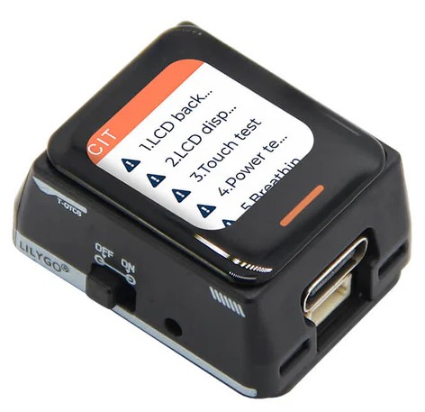
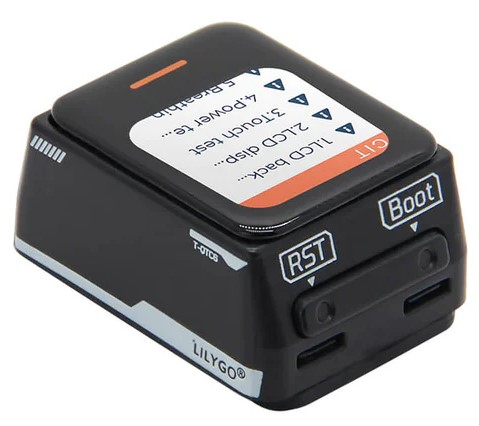
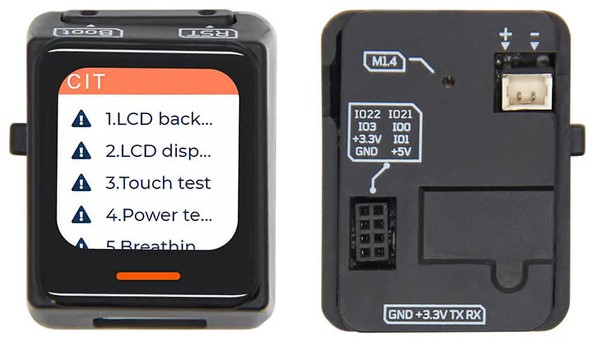

<h1 align="center">T-QT-C6</h1>

## **English** | [中文](./README_CN.md)

[](./LICENSE)
[](https://www.arduino.cc/en/software)
[](https://platformio.org/)

<p align="center">
  
</p>

## Overview

T-QT-C6 is a compact development board based on the ESP32-C6, with a 0.85-inch 128 × 128 LCD, capacitive touch, battery measurement, charging management, and an RGB breathing LED. An optional battery backboard adds a battery connector and an LSM6DSL inertial sensor.

[Purchase from the LILYGO store](https://lilygo.cc/products/t-qt-c6)

## Directory

- [Device Versions](#device-versions)
- [Notes](#notes)
- [Preview](#preview)
- [Supported Development Environments](#supported-development-environments)
- [Quick Start](#quick-start)
- [Examples](#examples)
- [Prebuilt Firmware](#prebuilt-firmware)
- [Hardware Modules](#hardware-modules)
- [Pin Overview](#pin-overview)
- [Power Consumption](#power-consumption)
- [Project Materials](#project-materials)
- [FAQ](#faq)

## Device Versions

| Version | Release date | Main change |
| :-- | :-- | :-- |
| T-QT-C6 V1.0 | 2023-12-20 | Initial release |
| T-QT-C6 V1.1 | 2024-03-27 | Added battery backboard support |
| T-QT-C6 V1.2 | 2024-06-13 | Replaced the charging IC with SGM41562 |
| T-QT-C6 Battery V1.2 | 2025-08-11 | Changed the battery connector to a 2-pin, 1.25 mm connector |

## Notes

- Select the connected battery backboard version in [`libraries/common/pin_config.h`](./libraries/common/pin_config.h). The default configuration is `T_QT_C6_Battery_V1_2`.
- Battery V1.2 uses a two-wire battery connection (VBAT and GND) without an external NTC thermistor. The SGM41562 application example therefore disables external NTC detection.
- `Arduino_GFX` and `cpp_bus_driver` are Git submodules. Clone this repository recursively or initialize the submodules before building.
- The factory-test example must match the charging IC fitted to the MCU board: use `Lvgl_CIT_ETA4662` for MCU V1.0/V1.1 and `Lvgl_CIT_SGM41562` for MCU V1.2.

## Preview

<p align="center">
  
  
  
</p>

## Supported Development Environments

| Development environment | Status | Configuration source |
| :-- | :--: | :-- |
| Arduino IDE | Supported | Use the Arduino-ESP32 version noted in [`platformio.ini`](./platformio.ini) |
| PlatformIO | Recommended | Use the repository's [`platformio.ini`](./platformio.ini) |

Framework versions, the board target, flash layout, USB CDC, and build environments are maintained in [`platformio.ini`](./platformio.ini) as the single source of truth.

## Quick Start

### Get the Source Code

Clone the project and its submodules:

```bash
git clone --recursive https://github.com/Xinyuan-LilyGO/T-QT-C6.git
cd T-QT-C6
```

If the project has already been cloned, initialize the submodules with:

```bash
git submodule update --init --recursive
```

### PlatformIO

1. Install [Visual Studio Code](https://code.visualstudio.com/) and the [PlatformIO IDE extension](https://platformio.org/install/ide?install=vscode).

2. Open [`platformio.ini`](./platformio.ini) and set `default_envs` to the required example, for example:

   ```ini
   [platformio]
   default_envs = GFX
   ```

3. Build, upload, and open the serial monitor:

   ```bash
   pio run
   pio run -t upload
   pio device monitor -b 115200
   ```

The selected environment name and `default_envs` must match because the example source directory is derived from `default_envs`.

### Arduino IDE

1. Copy all library folders from the repository's [`libraries/`](./libraries) directory to the `libraries` directory under your Arduino Sketchbook. The Sketchbook location is shown in **Arduino IDE > File > Preferences**. On Windows, the default destination is usually `Documents\Arduino\libraries`.

2. Open the `.ino` file in the required example directory.

3. Use the following Arduino IDE board settings:

| Setting | Value |
| :-- | :-- |
| Board | ESP32C6 Dev Module |
| Upload Speed | 921600 |
| CPU Frequency | 160MHz |
| Flash Mode | QIO |
| Flash Size | 4MB (32Mb) |
| Core Debug Level | None |
| Partition Scheme | Huge APP (3MB No OTA/1MB SPIFFS) |

### Examples

| Example link | Description |
| :-- | :-- |
| [`examples/`](./examples) | Current T-QT-C6 example sources |

Open the example directory for the current source and supported example list. For factory testing, select the environment that matches the board's charging IC as described in [Notes](#notes).

### Prebuilt Firmware

The following prebuilt firmware images are available.

For instructions on flashing prebuilt firmware, refer to Espressif's official [ESP firmware web flashing guide](https://docs.espressif.com/projects/esp-techpedia/en/latest/esp-friends/get-started/try-firmware/try-firmware-platform.html).

| Firmware | Flash address | Description |
| --- | --- | --- |
| [`firmware/`](./firmware) | `0x0 (merged)` | T-QT-C6 factory-test and sleep-example firmware |

> [!IMPORTANT]
> Select `ESP32-C6` when flashing T-QT-C6 firmware. Choose an image whose filename matches both the MCU board version and battery backboard version. Firmware for different hardware versions must not be mixed.

PlatformIO build artifacts are written to `.pio/build/<environment>/`. `firmware.bin` is the application image, while `firmware.factory.bin` is the merged image containing the bootloader, partition table, boot application, and firmware. The `.pio` directory is temporary and may be recreated by clean or build operations; copy any build that must be retained to another directory.

## Hardware Modules

| Module | Part | Interface / specification |
| :-- | :-- | :-- |
| MCU module | ESP32-C6-MINI-1U | RISC-V, 160 MHz, Wi-Fi 6, Bluetooth LE, IEEE 802.15.4 |
| Flash | Integrated | 4 MB |
| PSRAM | — | Not fitted |
| LCD | GC9107 (earlier) or ST7735 (latest) | 0.85-inch, 128 × 128, SPI |
| Touch | CST816T | Capacitive touch, I2C |
| Charger, MCU V1.0/V1.1 | ETA4662 | I2C |
| Charger, MCU V1.2 | SGM41562 | I2C |
| IMU, battery backboard | LSM6DSL | 6-axis accelerometer and gyroscope, I2C |
| RGB breathing LED | WS2812B/WS2812C | One-wire control |

## Pin Overview

Board pin definitions and hardware mappings are provided in the configuration file:

- [`pin_config.h`](./libraries/common/pin_config.h)

## Power Consumption

Measured with T-QT-C6 V1.2. See the [power-consumption test reports](./relevant_test) for the test conditions.

| Mode | Typical measured current |
| :-- | :--: |
| Light sleep | 553 µA |
| Deep sleep | 170 µA |

## Project Materials

- [Schematics](./project)
- [Datasheets](./information)
- [Test reports](./relevant_test)
- [Prebuilt firmware](./firmware)

## FAQ

<details>
<summary>Compilation reports that an Arduino_GFX or cpp_bus_driver header is missing</summary>

Initialize the Git submodules and build again:

```bash
git submodule update --init --recursive
```

</details>

<details>
<summary>The wrong example is built</summary>

Set `default_envs` in [`platformio.ini`](./platformio.ini) to the required example. This project derives `src_dir` from that value, so changing only the command-line environment is not sufficient.

</details>

<details>
<summary>Upload cannot start or the board is not detected</summary>

Connect the board with a data-capable USB cable. If automatic download mode fails, hold the **BOOT** button, start the upload, and release the button when writing begins.

</details>

<details>
<summary>There is no serial output</summary>

Use a baud rate of `115200` and select the ESP32-C6 USB serial/JTAG port. The supplied PlatformIO configuration enables USB CDC on boot.

</details>

<details>
<summary>Where are the generated firmware files?</summary>

They are located in `.pio/build/<environment>/`. Use `firmware.factory.bin` for a single merged factory image. Since `.pio` is a generated build directory, copy the image elsewhere if it needs to be kept.

</details>
