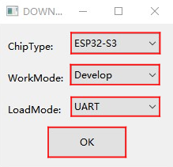

<!--
 * @Description: None
 * @version: V1.0.0
 * @Author: LILYGO_L
 * @Date: 2023-09-11 16:13:14
 * @LastEditors: LILYGO_L
 * @LastEditTime: 2023-12-22 16:23:36
 * @License: GPL 3.0
-->

<h1 align = "center">TQT-C6</h1>

 
  <!-- 
   -->
  

 

## **[English](./README.md) | 中文**

## 版本迭代:
| Version                               | Update date                       |
| :-------------------------------: | :-------------------------------: |
| TQT-C6_V1.0            | 2023-12-20                         |

## 购买链接

| Product                     | SOC           |  FLASH  |  PSRAM   | Link                   |
| :------------------------: | :-----------: |:-------: | :---------: | :------------------: |
| TQT-C6_V1.0   | ESP32C6 |   4M   | -|  [暂未售卖]()  |

## 目录
- [描述](#描述)
- [预览](#预览)
- [模块](#模块)
- [快速开始](#快速开始)
- [引脚总览](#引脚总览)
- [常见问题](#常见问题)
- [项目](#项目)
- [资料](#资料)
- [依赖库](#依赖库)

## 描述

TQT-C6是一款大小只有两个拇指头大小的基于ESP32C6芯片开发的迷你开发板，拥有一块128x128px像素的TFT全彩触摸屏幕，有独立的充电提示灯，有独立电池，与电源路径管理芯片进行通信可以修改电源总线状态和限制值，主芯片进入light_sleep模式，测量电池处的静态电流只有500uA左右，在deep_sleep模式下还可以达到100uA的极低功耗

## 预览

### PCB板

<b>TQT-C6</b>

### TQT-C6 正面

### TQT-C6 反面

### 渲染图

## 模块

### 1. ESP32-C6-MINI-1U

* 模块：ESP32-C6-MINI-1U
* PSRAM：4M 
* FLASH：-
* 其他说明：更多资料请访问[乐鑫官方ESP32-C6-MINI-1U数据手册](https://www.espressif.com/sites/default/files/documentation/esp32-c6-mini-1_mini-1u_datasheet_en.pdf)

### 2. 0.85英寸128x128像素LCD显示屏幕

* 驱动：GC9107
* 兼容库：Arduino_GFX、Lvgl
* 总线通信协议：标准SPI

### 3. 触摸芯片

* 芯片：CST816T
* 总线通信协议：IIC
* 其他说明：支持上滑、下滑、左滑、右滑、双击、单击、长按手势触发，还有多种中断触发方式结合一体，默认情况下无触摸几秒后自动进入睡眠省电模式

### 4. 电源管理芯片

* 芯片：ETA4662
* 总线通信协议：IIC
* 其他说明：具有电源路径管理的芯片，自动识别电池电源和USB电源，在无电池插入时候自动切换为USB供电，在无USB供电时候自动切换为电池供电

## 快速开始

#### 注意事项：目前ESP32C6只能使用Arduino IDE进行编程

### 例程支持

    

### PlatformIO
1. 安装[VisualStudioCode](https://code.visualstudio.com/Download)，根据你的系统类型选择安装。

2. 打开VisualStudioCode软件侧边栏的“扩展”（或者使用<kbd>Ctrl</kbd>+<kbd>Shift</kbd>+<kbd>X</kbd>打开扩展），搜索“PlatformIO IDE”扩展并下载。

3. 在安装扩展的期间，你可以前往GitHub下载程序，你可以通过点击带绿色字样的“<> Code”下载主分支程序，也通过侧边栏下载“Releases”版本程序。

4. 扩展安装完成后，打开侧边栏的资源管理器（或者使用<kbd>Ctrl</kbd>+<kbd>Shift</kbd>+<kbd>E</kbd>打开），点击“打开文件夹”，找到刚刚你下载的项目代码（整个文件夹），点击“添加”，此时项目文件就添加到你的工作区了。

5. 打开项目文件中的“platformio.ini”（添加文件夹成功后PlatformIO会自动打开对应文件夹的“platformio.ini”）,在“[platformio]”目录下取消注释选择你需要烧录的示例程序（以“default_envs = xxx”为标头），然后点击左下角的“<kbd>[√](image/4.png)</kbd>”进行编译，如果编译无误，将单片机连接电脑，点击左下角“<kbd>[→](image/5.png)</kbd>”即可进行烧录。

### Arduino
1. 安装[Arduino](https://www.arduino.cc/en/software)，根据你的系统类型选择安装。

2. 打开项目文件夹的“example”目录，选择示例项目文件夹，打开以“.ino”结尾的文件即可打开Arduino IDE项目工作区。

3. 打开右上角“工具”菜单栏->选择“开发板”->“开发板管理器”，找到或者搜索“esp32”，下载作者名为“Espressif Systems”的开发板文件。接着返回“开发板”菜单栏，选择“ESP32 Arduino”开发板下的开发板类型，选择的开发板类型由“platformio.ini”文件中以[env]目录下的“board = xxx”标头为准，如果没有对应的开发板，则需要自己手动添加项目文件夹下“board”目录下的开发板。

4. 打开菜单栏“[文件](image/6.png)”->“[首选项](image/6.png)”，找到“[项目文件夹位置](image/7.png)”这一栏，将项目目录下的“libraries”文件夹里的所有库文件连带文件夹复制粘贴到这个目录下的“libraries”里边。

5. 在 "工具 "菜单中选择正确的设置，如下表所示。

| Setting                               | Value                                 |
| :-------------------------------: | :-------------------------------: |
| Upload Speed                     | 921600                               |
| CPU Frequency                   | 160MHz                              |
| Flash Mode                         | QIO                                   |
| Flash Size                           | 4MB (32Mb)                     |
| Core Debug Level                | None                                 |
| Partition Scheme                | Huge APP (3MB No OTA/1MB SPIFFS)                                 |

6. 选择正确的端口。

7. 点击右上角“<kbd>[√](image/8.png)</kbd>”进行编译，如果编译无误，将单片机连接电脑，点击右上角“<kbd>[→](image/9.png)</kbd>”即可进行烧录。

### firmware烧录
1. 打开项目文件“tools”找到ESP32烧录工具，打开。

2. 选择正确的烧录芯片以及烧录方式点击“OK”，如图所示根据步骤1->2->3->4->5即可烧录程序，如果烧录不成功，请按住“BOOT-0”键再下载烧录。

3. 烧录文件在项目文件根目录“[firmware](./firmware/)”文件下，里面有对firmware文件版本的说明，选择合适的版本下载即可。

    
    

## 引脚总览

| LCD引脚       | ESP32S3引脚      |
| :------------------: | :------------------:|
| MOSI                     | IO15                  |
| SCLK                  | IO18                  |
| RST                    | IO20                  |
| BL                      | IO2                  |
| CS                    | IO14                  |
| DC                    | IO19                  |

| 电池相关引脚 | ESP32S3引脚      |
| :------------------: | :------------------:|
| Battery_Measurement_Control  | IO8                  |
| Battery_ADC_Data                  | IO6                    |

| 呼吸灯引脚          | ESP32S3引脚      |
| :------------------: | :------------------:|
| Breathing_Light                  | IO9                  |

| 触摸芯片引脚          | ESP32S3引脚      |
| :------------------: | :------------------:|
| RST                  | IO23                  |
| INT                  | IO7                    |
| SDA                  | IO21                  |
| SCL                  | IO22                  |

| 睡眠唤醒引脚          | ESP32S3引脚      |
| :------------------: | :------------------:|
| SLEEP_WAKE_UP_INT      | IO7                  |

| 电源管理芯片引脚          | ESP32S3引脚      |
| :------------------: | :------------------:|
| SDA      | IO21                  |
| SCL      | IO22                  |

## 常见问题

* Q. 看了以上教程我还是不会搭建编程环境怎么办？
* A. 如果看了以上教程还不懂如何搭建环境的可以参考[LilyGo-Document](https://github.com/Xinyuan-LilyGO/LilyGo-Document)文档说明来搭建。

 

* Q. 为什么打开Arduino IDE时他会提醒我是否要升级库文件？我应该升级还是不升级？
* A. 选择不升级库文件，不同版本的库文件可能不会相互兼容所以不建议升级库文件。

 

* Q. 为什么我的板子上“Uart”接口没有输出串口数据，是不是坏了用不了啊？
* A. 因为项目文件默认配置将USB接口作为Uart0串口输出作为调试，“Uart”接口连接的是Uart0，不经配置自然是不会输出任何数据的。 PlatformIO用户请打开项目文件“platformio.ini”，将“build_flags = xxx”下的选项“-DARDUINO_USB_CDC_ON_BOOT=true”修改成“-DARDUINO_USB_CDC_ON_BOOT=false”即可正常使用外部“Uart”接口。 Arduino用户打开菜单“工具”栏，选择USB CDC On Boot: “Disabled”即可正常使用外部“Uart”接口。

 

* Q. 为什么我的板子一直烧录失败呢？
* A. 请按住“BOOT”按键重新下载程序。

## 项目
* [SCH_TQT-C6_V1.0](./project/SCH_TQT-C6_V1.0.pdf)

## 资料
* [Espressif](https://www.espressif.com/en/support/documents/technical-documents)
* [ETA4662_V1.8](./information/ETA4662_V1.8.pdf)
* [AN-CST816T-v1](./information/AN-CST816T-v1.pdf)
* [WS2812B-2020](./information/WS2812B-2020.pdf)
* [WS2812C-2020](./information/WS2812C-2020.pdf)

## 依赖库
* [Arduino_DriveBus-1.0.0](https://github.com/Xk-w/Arduino_DriveBus)
* [Arduino_GFX-1.3.7](https://github.com/moononournation/Arduino_GFX)
* [lvgl-8.3.5](https://github.com/lvgl/lvgl)
